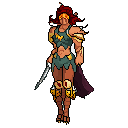
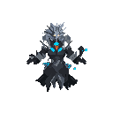
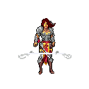
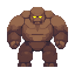
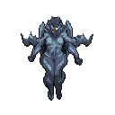
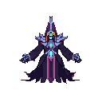

| Player Name  | Special Ability Description                                                           | Base Stats (HP / ATK / DEF) | Image Example                          |
|------------------|----------------------------------------------------------------------------------------|------------------------------|----------------------------------------|
| **Wonderwoman**  | **Power Strike**: Deal double damage to all enemies                                   | 130 / 20 / 8                 |   |
| **Wizard**       | **Fireball**: Deal 25 fixed damage to all enemies                                     | 110 / 25 / 4                 |             |
| **Omen**         | **Shadow Strike**: Deal 20 damage to all enemies and gain +5 defense                  | 120 / 19 / 6                 |                 |
| **Hulk**         | **Healing Factor**: Heal 20 HP and slam all enemies for 10 damage                     | 150 / 16 / 12                |                 |
| **Predator**     | **Piercing Shot**: Deal damage equal to ATK to all enemies, ignoring defense          | 125 / 22 / 7                 |         |

---

| Enemy Name     | Special Trait / Theme (for balancing)                  | Base Stats (HP / ATK / DEF) | Image Example                            |
|----------------|--------------------------------------------------------|------------------------------|------------------------------------------|
| **Clayman**     | High HP, weak defense — "Berserk Rage" style          | 75 / 12 / 1                  |             |
| **Skull**       | Fragile and fast attacker — "Bone Throw"              | 60 / 13 / 1                  |                 |
| **Dragon**      | Balanced high-tier enemy — "Flame Breath"             | 100 / 16 / 3                 |               |
| **Stealer**     | Low HP, sneaky stabber — "Sneaky Stab"                | 55 / 10 / 2                  |             |
| **Dark Knight** | Thematic strong finisher — "Dark Slash"               | 90 / 14 / 2                  |      |
