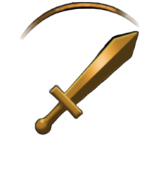

# Tower-Leveling-Clash

Tower Leveling Clash is a Pygame-based turn-based roguelike card game where players battle enemies across multiple floors, collecting items and making strategic choices.

## 🧰 Requirements

- Python **3.11.9** (recommended)  
- pip >=24.0  
- pygame >=2.6.1  
- setuptools >=65.5.0

> 💡 The game may also run on other compatible Python 3 versions (e.g., 3.10.x or 3.12.x), but Python 3.11.9 is the version this game was developed and tested with.

## ⚙️ Setup Instructions

### 1. Clone the repository

```bash
git clone https://github.com/your-username/Tower-Leveling-Clash.git
cd Tower-Leveling-Clash
```

### 2. Create a virtual environment (optional but recommended)

```bash
python -m venv venv
venv\Scripts\activate   # On Windows
# source venv/Scripts/activate   # On macOS/Linux
```

### 3. Install the required packages

```bash
pip install -r requirements.txt
```

### 4. Run the game

```bash
python main.py
```

## 📌 Notes

- Make sure you have Python **3.11.9 or a compatible version** installed.
- This setup works on Windows, macOS, and Linux environments.

## 🎮 How to Play Tower-Leveling-Clash

### 🔘 Game Controls

| Button          | Action         | Description                                   | Image Example                |
|----------------------|----------------|-----------------------------------------------|------------------------------|
| Attack Button | **Attack**     | Deal basic damage to an enemy.                |  |
| Skill Button  | **Use Skill**  | Use your character’s special ability.         |    |
| Inventory Button     | **Inventory**  | View and use items you've collected.          |  |
| Shop Button   | **Shop**       | Buy items between battles using earned coins. |      |
| Back Button | **Go Back**    | Return to the previous screen.                |      |      |


Enjoy playing Tower Leveling Clash!
