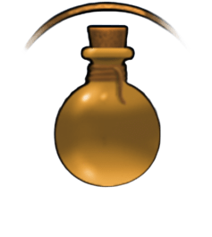

# Tower-Leveling-Clash

Tower Leveling Clash is a Pygame-based turn-based roguelike card game where players battle enemies across multiple floors, collecting items and making strategic choices.

## 🧰 Requirements

- Python **3.11.9** (recommended)  
- pip >=24.0  
- pygame >=2.6.1  
- setuptools >=65.5.0
- numpy==2.2.4
- pandas==2.2.3
- matplotlib==3.10.1
- pillow==11.1.0

> 💡 The game may also run on other compatible Python 3 versions (e.g., 3.10.x or 3.12.x), but Python 3.11.9 is the version this game was developed and tested with.

## ⚙️ Setup Instructions

### 1. Clone the repository

```bash
git clone https://github.com/Sorasit-Kateratorn/Tower-Leveling-Clash.git
cd Tower-Leveling-Clash
```

### 2. Create a virtual environment (optional but recommended)

```bash
python -m venv venv
venv\Scripts\activate   # On Windows
source venv/bin/activate # On Mac/Linux
```

### 3. Install the required packages

```bash
pip install -r requirements.txt
```

### 4. Run the game

```bash
python main.py
```

## 📌 Notes

- Make sure you have Python **3.11.9 or a compatible version** installed.
- This setup works on Windows, macOS, and Linux environments.

## 🎮 How to Play Tower-Leveling-Clash

Tower-Leveling-Clash is a turn-based roguelike card game where you must battle your way through enemies on each floor and reach the top to claim victory.

### 🧙 Step-by-Step Guide

1. **Choose Your Hero**  
   Begin by selecting one of the 5 unique characters — each with their own stats and special skill. Choose wisely based on your preferred playstyle.

2. **Start the Battle & Visit the Shop**  
   Once the game begins, you'll have the chance to visit the **Shop** to buy helpful items using your starting coins. Plan your purchases to gain an edge in upcoming battles.

3. **Clear Each Floor**  
   Fight through waves of enemies on each floor using attacks, skills, and items. The deeper you go, the tougher the enemies become.

4. **Reach the Final Floor**  
   Survive and defeat all enemies on every floor. If you reach and conquer the final floor — **you win the game!**

> 📝 Tip: Use your skills strategically and manage your inventory to stay alive as long as possible.


### 🔘 Game Controls

| Action         | Description                                   | Image Example                        |
|----------------|-----------------------------------------------|--------------------------------------|
| **Attack**     | Deal basic damage to an enemy.                |           |
| **Use Skill**  | Use your character’s special ability.         |   |
| **Inventory**  | View and use items you've collected.          |     |
| **Shop**       | Buy items between battles using earned coins. |               |
| **Go Back**    | Return to the previous screen.                |     |
| **Use Item**   | Use a selected item from your inventory.      |        |
| **Sell Item**  | Sell unwanted items for coins in the shop.    |  |


## 🧪 Items & Effects

See all in-game items, their effects, and icons here:  
👉 [Item Reference Table](ITEMS.md)


Enjoy playing Tower Leveling Clash!


## UML Diagram

Below is the UML diagram for the project structure


---

## 🔗 Resources

* 🎥 YouTube Presentation Video: [Gameplay]()

---